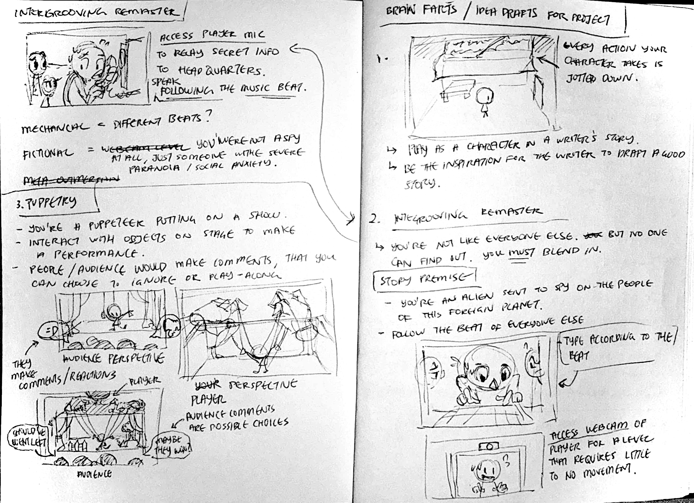

# Project Description 
This project is my attempt at implementing outmersive elements highlighted in my thesis to showcase the practical usage of the term and consoildating it into a short narrative puzzle game. The game would touch upon two aspects of outmersion: mechanical outmersion and fictional outmersion. The main goal is to have players contemplate and critically analyze the game beyond the game itself.

# Process Documentation

## 16 April 2025 - The beginning
***
It all started with a late night rush of desperation to come with ideas to present for a meeting with advisors that prompted me to begin furiously scribbling down the first things in my head.

I personally enjoyed the idea to create a rhythm game for the project as it has been on my personal bucket list for awhile. But I still tried to push for 2 more ideas so I don't fall into a narrow hold when brainstorming.

## 17 April 2025 - Brainstorming
***
I was very hung up on the idea of creating a rhythm game for this project as the idea of player actions being controlled by rhythm fits within the idea of outmersion and can be considered a mechanical fourth wall break due to it having the ability to distate the player's physical actions. After a discussion with my first advisor, a rhythm game requires a solid game mechanics that takes a good chunk of time to build and is not particularly easy. A prototype has to be done in a span of at least 1 week or 2 first before considering diving deep into developing the idea.

This sounds rather daunting, but I do enjoy the idea of working on a rhythm game as it has been on my bucket list for awhile and I never got to fulfil it as of yet. But perhaps it would be wiser to start of with an overarching theme and manifesto that I can always refer back to when designing the game so I don't get lost in the chaos of my own mind.

## 21 April 2025 - Then there was light
***
As I was lazing about enjoying the Easter weekend, I came upon a particular game on steam and was mesmerised by the sheer ingenius in implementing the ideas of puppetry within the puzzle game. [A Fisherman's Tale](https://store.steampowered.com/app/559330/A_Fishermans_Tale/) was incredibly intriguing and I adored the way the game looks and plays with its mindbreaking puzzle concepts, reminding me of the Puppetry idea I previously had in my scribbles (but cooler and better). Having a model of the room and character smaller than the player as well as a larger version compared to the player. While simulatneously creating puzzles that requires the usage of those different models to proceed forward in the game.

## 24 April 2025 - Getting down to business
***
The most difficult part is to start, so instead of thinking up the full details of the game plan, I decided to just take the leap and make something for the coming Playtest Evening next Tuesday. 

I decided to try recreating A Fisherman's Tale's and started out with a basic first person perspective animated player controller where you can see your own body. After trying to recreate the large, medium and small version of the player, I realised that it's incredibly tricky to match up the movement for each version and the scaling has to be very accurate in terms of space and movement velocity across the different scales to make it work correcty. No wonder the VR game restricted the player's movement by making them jump from fix positions to another fix position to overcome that movement and placement matchup.

## 1 May 2025 - Developing the prototype
***
I spent the whole day working on the prototype trying to get the core features of the game to work properly. Basically added the function to stop player movement when spacebar is pressed while still being able to look around. Also added the function to drag an interactable object with the player when holding the left mouse button.

## 3 May 2025 - Last push to finish first prototype
***
I wanted to finish the 1st prototype as soon as I can so I could push it out to people to playtest the controls I have made and the get the feedback for the general feel of the game. I managed to have that done and sent it out to both my advisors, hopefully it isn't too janky or jarring to play. There are still many things I have to do to develop the main mechanic but here's a list of what I've done and what I should focus to work on next:

Done:
+ Player movement and base interactions with interactable objects
+ when interactable is in Puppet Zone, player can't take interactable
- Door detects if object is correct before opening
- Player stops moving when spacebar is pressed
- Basic start menu and pause menu functionalities

To Do:
- Fix puppet movement 
- Puppet should squat when spacebar is not pressed so it doesn't move along with player every moment (unless puzzle intends for it to do so)
- Fix physics issue when key is picked up it pushes player back
- Brainstorm level ideas to proceed in the game
- Brainstorm narrative that ties into the puzzles of the game

## 7 May 2025 - Revamp entire prototype
***
Had a meeting with Csongor and got some valuable feedback on the project's control and overall direction its heading. Currently the movement of the puppet is too jarring with the Player's movement and there was confusion how to control the puppet. Had some feedback from others as well voicing similar issues. There was contradicting opinions on the puppet movement, some mentioned that it is incredibly confusing and hard to control, while others mentioned that the challenge is rather fun. While I always enjoy the idea of "its not a bug, its a feature", for this particular scenario I do think it should be reworked to provide a more controlled intended janky-ness instead of an unintended one.

I decided to rework on the core movement systems and scrap the entire prototype due to some render pipeline shenanigans in Unity that causes the project to load incredbily slow during play mode. I opened a completely new project and stuck with URP as the main render pipeline and rebuild all imported assets to fit within it. I've also decided to build the game solely using visual scripting and not C# due to the speed and convenience it offers.

The main player's movement still uses some C# script that I got from the unity's official sample asset, but that is as far as it goes. The scripts are well documented and easy to read and dissect its parts and thus making it easy for me to make changes. Everything else on the other hand would be done in visual scripting from here on out.

Project's technical outline:
+ URP render pipeline
+ Code in visual scripts only

## 8 May 2025 - Update on some brainstorm scribbles
***

I added new ideas on the right side of the board with all the yellow stars, highlighting the core mechanics and what I need to do to accomplish it. I decided to focus on the theme of control in this game. I want the players to question who truly has control within the game. Though the player has the ability to manipulate the contents of the game and the characters, are the actions they take really their own? or are they just a mere pawn on the board? 

These are the kind of questions I would like to convey within the game, though I am rather worried of the impending scope creep this might result in trying to achieve it. :'D

## 12 May 2025 - A change of pace
***
I decided to head to the university to work on my project for a change of pace and hoping if I place my brain in a different environment I would be able to get fresher ideas on how to proceed forward with the project. After spending the weekend fully scrapping my prototype and starting anew, I managed to get it towards the same state as the previous prototype, but now with lesser bugs and simplified control systems! I brought it on to Florian for a quick playtest and had some interesting feedback on the game's puzzle and overall concept.

Here's a rough summary from the playtest session:
+ The concept of having different sized keys and different sized keyholes needed to be pushed further visually for players to notice their differences
+ Understanding the need to swap the keys amongst the different scaled versions of yourself was not the easiest thing to pick up on
+ The concept was interesting, due to the antique key and keyholes, the game's theme seem to fit a more fantasy genre instead of sci-fi (eg. portal style, which was my initial idea brought on by the style of the sample assets I was using)
+ Having the player control multiple characters at once with one set of control is not bad, having different ways to control the puppets would be interesting
+ Fourth wall breaking elements like the player looking up and seeing the projection of themselves through the webcam would sell that idea more

After contemplating these feedback, it kind of spurred me to work on the narrative elements of the game. Ideas of the story I needed to tell and how to tell that story rolled in my head for awhile and I came up with a base premise:
> A dollmaker obssessed with perfecting his craft, steals the 'souls' of players who wander into his domain and make them into puppets for his collection. He tricks players with the help of his spider familiar by pretending to help them escape, just for them to be lead into his trap at the end.

Basically the story starts by the player assuming they were turned into a puppet and need to turn themselves back to escape. They are lead by a narrator pretending to be their conscience (think Jiminy Cricket in Pinnochio) who explains their situation and help them proceed through the game.

I drafted some additional flavour mechanics in the game where the narrator would ask seemingly strange and intrusive questions about the player's original appearance (before they got turned into a puppet). Simple dialogue options are presented to get information on how the player actually looks to customize the look of their puppet at the end.

## 15 May 2025 - Blocking out levels according to storybeats
***
After being invigorated by the narrative for this game, I started getting assets to start blocking out levels following the storybeats. I had a rough idea in mind for the player to start in a storage room, as if they were tossed aside and forgotten.

I continued to work on fixing some bugs that causes discrepancies between the different scaled version of the player. I still have not fully work out all the kinks as there is a problem with matching up the pickup range for the different scaled versions to the player without causing unneccessary interactions.

## 18 May 2025 - Getting low with some beats
***
I added the ability to crouch down to grab objects that the player has dropped on the ground to limit the pickup range for each version so they are not able to interact to anything beyond their realm except for the player. 

Progress has been slow this week as most of my time I was brainstorming on the storybeats of the game and narrowing down the scope to make it more achievable while explaining the narrative in its entirety. 

I narrowed it down to 6 rooms for the entire game. This can be reduced or expanded further with more puzzle rooms but so far my brain was only able to come up with two puzzles.

1. **Storage Room** -- the starting area, where the narrator will explain why they are here and how they must get out before its too late.
2. **Room of Keys** -- a tutorial area to showcase different scaled keys and keyholes and the need to match them to proceed forward.
3. **Room of Scales** -- Two scaled versions of the player (who copies the players movement) and the room exists and the player has to get the correct key to move forward. Exchanging the key from the different scaled version of the player is how to proceed forward.
4. **Mirror Room** -- A mirrored version of the room exists on the other side of a glass pane, but not everything that is within the mirrored room exists in the player's room. The player has to manipulate a puppet within their room to open the door in the mirrored room to unlock their own door.
5. **Corridors of Secrets** -- I picture this as an area between puzzle rooms for dialogues to happen, the narrator would ask strange questions about the player and the player can answer them. There would be a total of 3 corridors:
    + The corridor between the keys and scales room
    + A corridor between the scales and mirror room
    + A corridor between the mirror room and the final area.
6. **Judgement Room** -- This isn't a room and more of a cutscene that reveals the player's true circumstances in the game.

## 20 May 2025 - Organisation and Cleanup
***
I added an alternate level for the different scaled version level with a layout suggested by Florian previously. I've also did a cleanup of the different prefabs and mechanics, basically made them more modular and easy to implement within new levels.

## 3 June 2025 - Playtest Evening Feedback
***
I added a mirror room level in the game where the player has to grab a key that only exists in the puppet's room and learn to pass the key back and forth. I've also compiled some standouts during the playtesting session in university.

Feedbacks:
+ Most people have difficulty understanding the mirroring mechanic
+ People tend to click multiple times to get the key whenever they can't get it the first try, so separating pickup and drop controls would be better
+ Some people think they had to unlock the door for the puppet as well to proceed forward, even if their own door has already been unlocked
+ Only one person managed to look up in the different scale levels and most don't, so separating them would present better clarity.
+ Someone suggested a key dropping SFX to indicate the key has been successfully passed to your area
+ People generally enjoy the concept of the game and think its cool

Suggestions:
+ Pressure plates level for that asyncronicity effect, having player use a pressure plate and manipulate the puppet without themselves moving
+ Move yourself into a different scaled dimension to proceed instead of just passing keys around

## 8 June 2025 - Contemplation
***
I decided to work on fixing the raycasting issue that the Player's pickup mechanic by changing it to a sphere cast instead to get a wider radius to pickup objects. I've also added a mechanic of an input and output box to transfer keys between different scaled versions of the room.

## 9 June 2025 - Lights and Cameras
***
I decided to work on the story setting level and added a timeline element to create an opening cutscene. Everything is still scene specific and I should work on creating a modular workflow for implementing cutscenes in each level.

I am still contemplating how to end the game in a satisfying way as the common feedback for the game is people wanting to play more levels, they are interested and like the concept of the game, but they want to see more and I personally struggle coming up with interesting puzzle designs for the game and I had to weigh in on the scope of the project and the feeling I wanted to convey to fit my thesis.

## 17 June 2025 - Dressing up
***
There was a feedback of adding a sound effect to the key hitting the floor to indicate that a key has successfully passed on to the player's side of the arena.

Progress was also made to continue set dressing the tutorial and mirror room levels. Adding assets and mood lighting to the game scenes along with creating prefabs to allow me to quickly set up the next level with reoccuring asset sets.

I did face some difficulty with the Mirror Room level as the idea of that room was added purely to introduce the mechanic of passing over keys across different levels. I struggle with finding a story-related purpose the room contains and a theme I could refer to make it more interesting.

## 28 June 2025 - Further Dressing
***
I continued my progress in set dressing the remaining levels and tried to brainstorm possible ways to end the game in an impactful way. 

Harking back to the rough storyboard I envision awhile back, I decided to work on building the space for the final cutscene that reveals the true nature of the game.
One where the player finds out that the narrator who has been perceived as someone who is helping them escape their strange confinement was actually leading them into their demise.

I blocked out the room, created, rigged and animated the True Puppeteer and I'm currently blocking out the camera angle as well. I wonder if it is getting too complex for me to achieve as I am running out of time to finish this project.

## 1 July 2025 - Say Cheese~
***
I incorporated the player's webcam into the final cutscene to showcase the True Puppeteer grabbing the player's "soul" for their next creation. I initially wanted to be able to customize the final creation to look like the player themselves but that requires quite a number of prompts before in the game to gather enough information too create them.

There was the idea of a big spider that is the narrator in the game to appear in the final cutscene as well but creating, rigging and animating them within this short time frame seems to be too steep of a climb to accomplish.